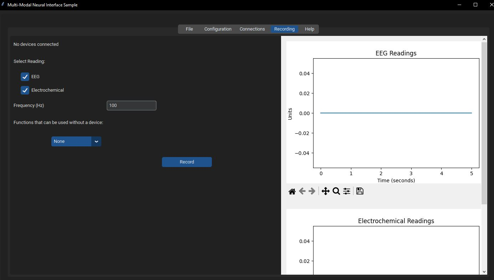

## Python GUI for the Multi-Modal-Neural-Interface

Requirements:

- python version 3 and above
- pip

### Install the required python dependencies
pip install -r requirements.txt

### To start the gui run:
py app.py

## Recording Page:

